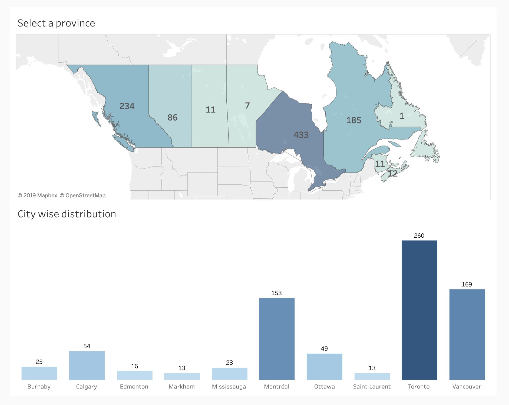
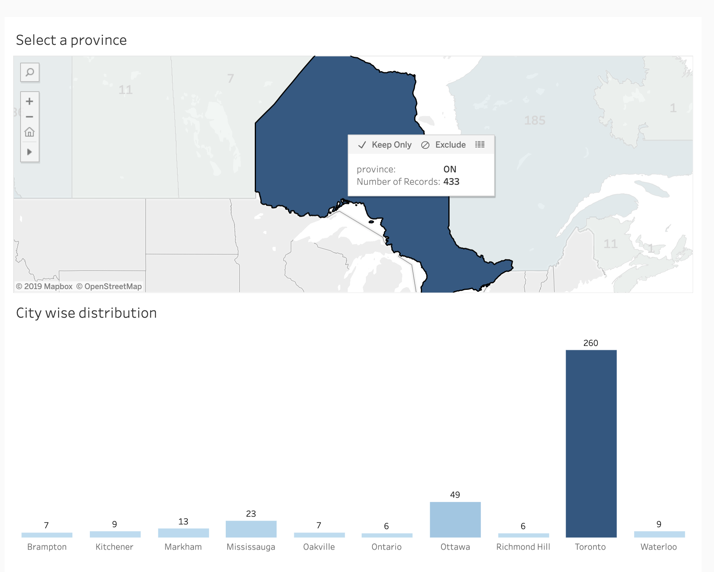

In this repository, I am publishing my analysis of indeed data for data scientist job postings across Canada.

## Instructions

### Mining
* Used Beautiful Soup library in Python to mine the data.

### Pre-processing
* Relevant information was put into a dataframe then data was cleaned using Pandas library

### Exploring and Visualizing
* Used Tableau to explore and visualize the data

